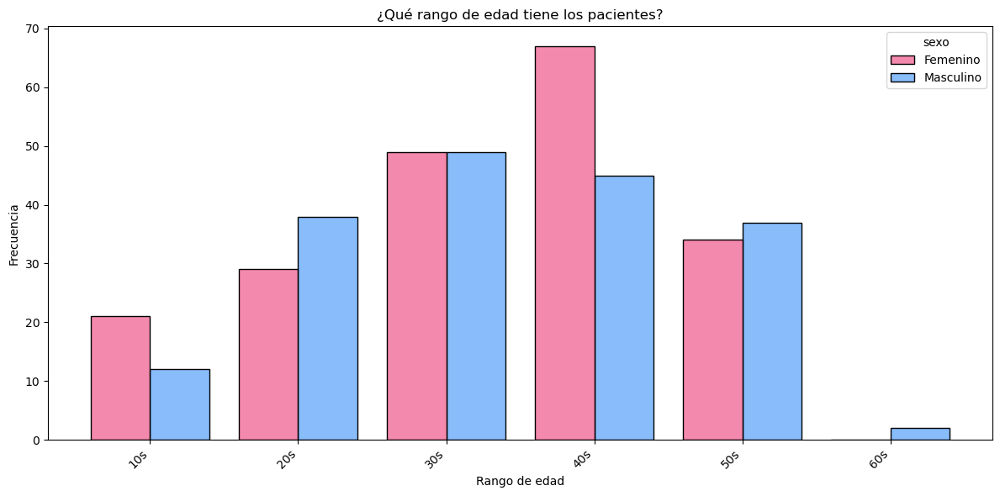
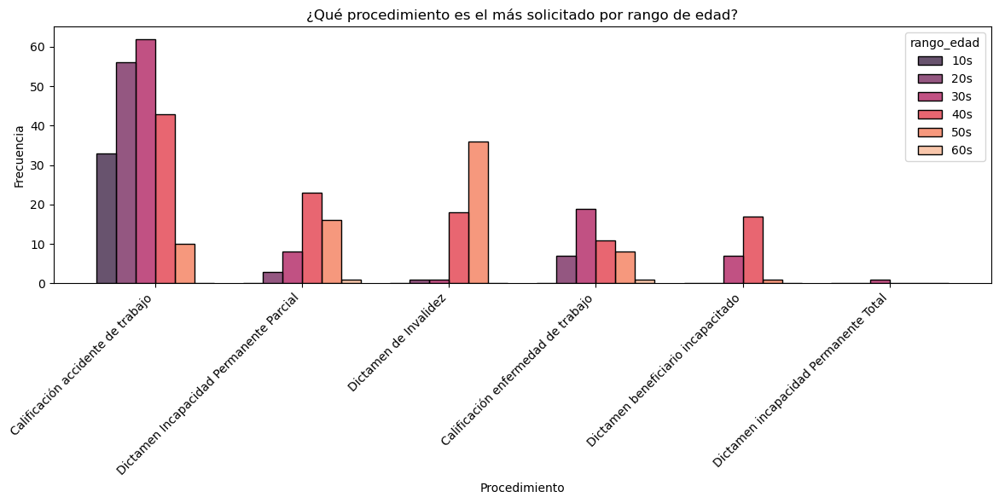
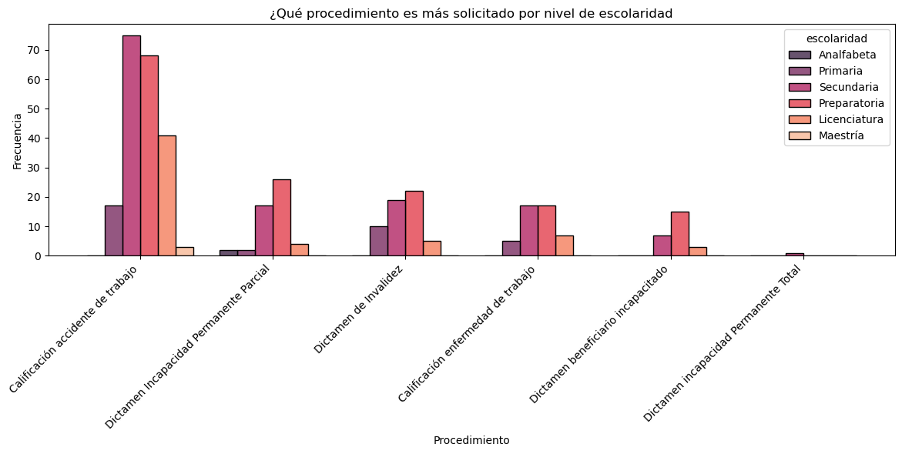
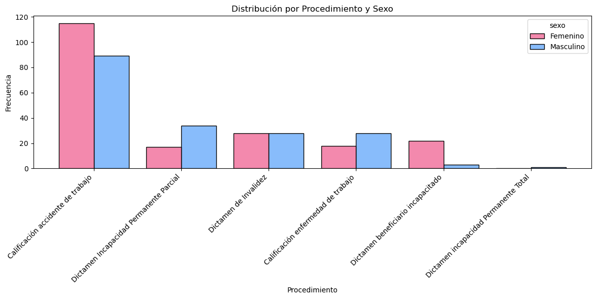
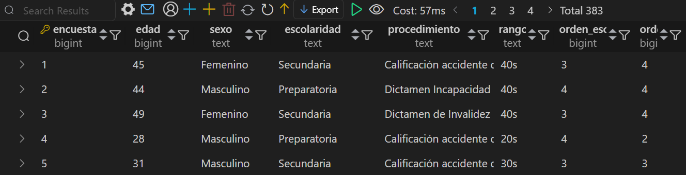
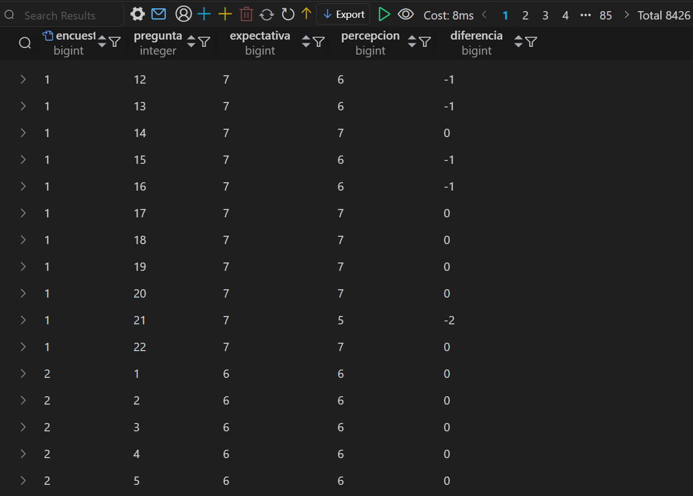
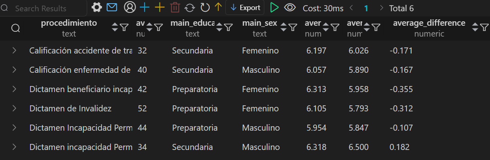
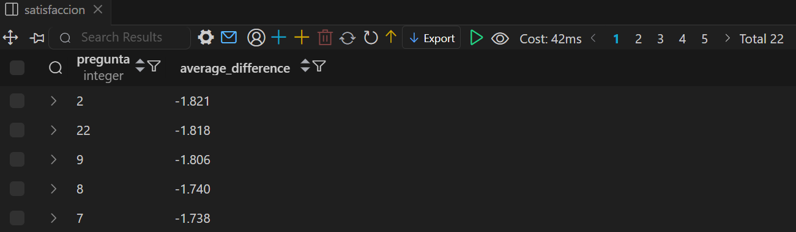
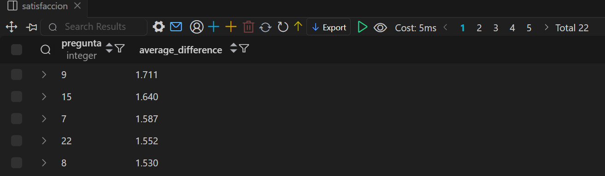
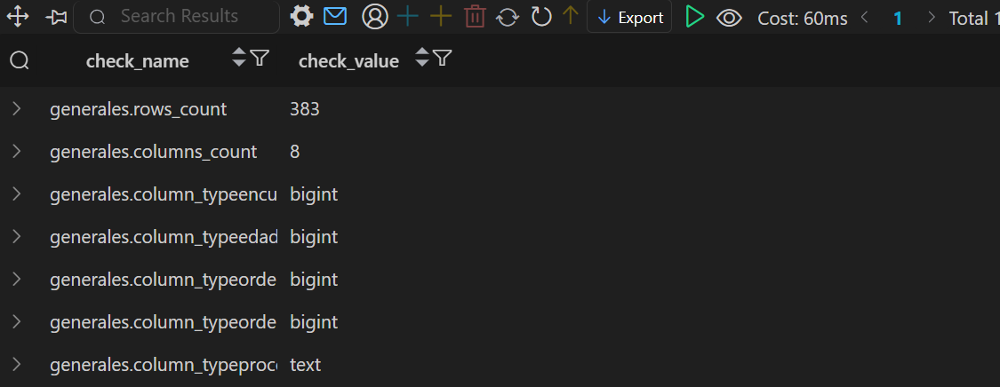

# Tabla de contenidos

- [Introducción](#Introducción)
- [Objetivo](#Objetivo)
- [Metodología](#Metodología)
    - [Recolección de datos](#Recolección-de-datos)
        - [Estructura de las encuestas](#Estructura-de-las-encuestas)
        - [Confidencialidad](#Confidencialidad)
    - [Etapas](#Etapas)
    - [Diseño](#Diseño)
        - [Componentes requeridos en el dashboard](#Componentes-requeridos-en-el-dashboard)
        - [Boceto de dashboard](#Boceto-de-dashboard)
        - [Herramientas](#Herramientas)
        - [Flujo de trabajo](#Flujo-de-trabajo)
- [Desarrollo](#Desarrollo) 
    - [Pseudocódigo](#Pseudocódigo)
    - [Exploración de datos](#Exploración-de-datos)
        - [EDA](#EDA)
    - [Limpieza de datps](#Limpieza-de-datos)
    - [Transformación de datos](#Transformación-de-datos)
    - [Impresiones generales](#Impresiones-generales)
    - [Scripts de automatización  en Python](#Scripts-de-automatización-en-Python)
        - [Pipeline reproducible](#Pipeline-reproducible)
    - [Capa analítica en PostgreSQL](#Capa-analítica-en-PostgreSQL)
    	- [Modelado de datos](#Modelado-de-datos)
    	- [Organización de scripts SQL](#Organización-de-scripts-SQL)
    	- [Ejecución del pipeline SQL](#Ejecución-del-pipeline-SQL)    

# Introducción

El servicio de medicina del trabajo del Hospital General de Zona de Medicina Familiar 21, busca evaluar la calidad del servicio que sus pacientes reciben al realizar alguno de los siguientes procedimientos:

- Calificación accidente de trabajo  
- Dictamen Incapacidad Permanente Parcial
- Dictamen de Invalidez
- Calificación enfermedad de trabajo
- Dictamen beneficiario incapacitado
- Dictamen de invalidez
- Dictamen incapacidad Permanente Total

Se tiene interes en comparar las expectativas y percepciones de la atención médica.


# Objetivo

1. Diseñar y crear un dashboard interactivo que muestre:


    - Información general de los pacientes del servicio de medicina del trabajo utilizando slicers para visualizar las difrencias en la atención por procedimiento. 
    - Comparación entre las expectativas y percepciones del servicio médico recibido.

2. Crear una base de datos relacional que alimente al dashboard en el futuro.

# Metodología

## Recolección de datos

El personal médico aplicó encuestas a 383 pacientes que constaron de 22 preguntas. Cada paciente respondió dos encuestas una previa a la atención médica y la segunda después de haber recibido la atención médica. Todas las encuestas fueron llenadas en el lugar físico después de obtener el consentimiento informado de los pacientes participantes, a los cuales se les explico el alcance del estudio. Una vez recolectados los datos el área médica cargo dichos datos en un archivo tipo .csv.

### Estructura de las encuestas

Cada encuesta constaba de:

- Encabezado: Segmento dedicado a recabar información general del paciente tal como edad, nombre, sexo, escolaridad y procedimiento solicitado.

- Cuerpo: Segmento que contaba con 22 preguntas dedicadas a evaluar la satisfacción, tiempo dedicado y expectativas de los pacientes.

### Confidencialidad

Por razones de confidencialidad de los pacientes las preguntas no se muestran y los datos originales fueron modificados para no incluir información personal sensible que pueda ser ligado a los paciente en particular con fines de proteger sus datos personales.

## Etapas

- Diseño
- Desarrollo
- Prueba
- Análisis

## Diseño

### Componentes requeridos en el dashboard

¿Qué componentes debería de incluir el dashboard?

Para entender que debería de incluir se realizarón las preguntas siguientes:

1. ¿Qué edad tienen los pacientes?
2. ¿Qué escolaridad tienen los pacientes?
3. ¿Cuál es la proporción entre hombres y mujeres?
4. ¿Cuantos pacientes se reciben por procedimiento?
5. ¿Cuál es la expectativa de la atención médica?
6. ¿Cuál es la percepción de la atención médica recibida?
7. ¿Es mayor la expectatva o la percepción de la atención médica recibida?

### Boceto de dashboard

¿Cómo se vería el dashboard final?

Algunos elementos visuales para responder apropiadamente a las preguntas del personal médico incluirían:

1. Tabla de comparación de _expectativa_, _percepción_ y _diferencia_ por pregunta.
2. Gráfico de área que permita comparar rápidamente _expectativa_, _percepción_ y _diferencia_ por pregunta.
3. Gráfico de columnas agrupadas para conocer la distrbución del rango de edad de los pacientes.
4. Gráfico de columnas agrupadas para conocer la distribución de la escolaridad de los pacientes.
5. Un medidor para conocer la proporción de pacientes.
6. Un segmentador por procedimiento.
7. Un segmentador por sexo.


### Herramientas

| Herramienta | Rol | Responsabilidades |
|------------|-----|------------------|
| Excel | Fuente inicial de datos médicos | Almacenamiento del archivo original de encuestas.<br> Revisión preliminar. |
| Python (Notebooks) (_pandas, matplotlib, seaborn_) | Exploración y preprocesamiento de datos | Análisis exploratorio (EDA).<br> Limpieza y transformación de datos.<br> Ingeniería de características.<br> Visualizaciones exploratorias. |
| PostgreSQL DB | Capa analítica y de modelado de datos | Creación de tablas normalizadas.<br> Definición de _primary keys_ y _foreign keys_.<br> Creación de vistas analíticas.<br> Validación de calidad de datos. |
| Power BI | Visualización y comunicación de resultados | Consumo de tablas y vistas exportadas.<br> Creación de relaciones entre entidades.<br> Construcción de visuales y dashboard ejecutivo. |
| GitHub | Control de versiones y presentación del proyecto | Versionado de código y scripts SQL.<br> Organización del proyecto por capas (data/sql/scripts/notebooks).<br> Documentación del flujo de trabajo y reproducibilidad. |

### Flujo de trabajo

1. A partir de un archivo .csv de Excel ubicado en data/raw se realizó la exploración inicial de los datos.
2. Se alimentó el notebook _EDA_ en el cual se realizó:
    - Limpieza de datos.
    - Estandarización de encabezados.
    - Corrección de errores de importación.
    - Visualización incial da los datos.
  

El output fue _preprocessing.csv_.


3. El archivo _preprocessing.csv_ fue el input para el notebook _Preprocessing.ipynb_ enfocado en:
    - Enriquecimiento y transformación de características.
    - Cambio en tipo de variables recien añadidas.
    - Visualización a detalle con datos transformados.

    
El output fue el dataset _df_sql.csv_.


4. Al archivo anterior fue cargado en PostgreSQL iniciando el *pipeline* automatizado que creó tablas, validó calidad de datos y generó vistas analíticas mediante scripts ejecutados secuencialmente desde Python, garantizando reproducibilidad del modelo de datos. La secuencia del pipeline fue la siguiente:
    - load_to_postgres.py

   
      Carga el dataset procesado (df_sql.csv) desde data/processed/ hacia PostgreSQL, creando o reemplazando la tabla base df_sql. El modelado de bases de datos         incluyo la creación de las tablas _generales_ y _satisfaccion_, la creación de claves primarias, creación de vistas finales y normalización de tablas.
    - run_sql_pipeline.py
  
      
      Se realizaron valiaciones de calidad de datos de las tablas de salida del pipeline de SQL que alimentaron a Power BI, comprobando la centa de filas,               columnas, el tipo de dato por columna y la existencia de filas duplicadas.
      Se crearon scripts de SQL analíticos para la consulta KPIs como: ¿Cúal fue la pregunta con la mayor diferencia negativa? ¿Cúal fue la pregunta con la mayor        diferencia positiva? ¿Cuantos pacientes se tienen por procedimiento?
   - export_to_csv.py
  
     
     Extrae tablas y vistas finales desde PostgreSQL y las exporta a .csv para su consumo en Power BI y visualización reproducible.


5. Se almacena el ouput del pipeline en la ubicación sql/:

    - ddl

   Almacena las tablas y vistas finales que consumió Power BI.
   Almacena un script para la limpieza de KPIs dependientes previos que pudieran ocasionar errores al ejecutar el pipeline.

   - dml
     
   Almacena las consultas analíticas que no serán consmidas por elementos visuales de Power BI (KPIs)
  
   - quality
     
    Almacena los scripts de validación de datos para las tablas que alimentan a Power BI.
     
     
6. Se generó el dashboard en Power BI usando como input las tablas _generales_ y _satisfaccion_ y las vistas finales craedas con la ejecución del SQL pipeline.


# Desarrollo

## Pseudocódigo

- ¿Cuál es la estrategia general para crear la solución desde el inicio al final del proyecto?

1. Obtener datos.
2. Explorar los datos iniciales usando pandas, matplotlib y seaborn.
3. Realizar la limpieza de datos verificando que no haya datos nulos ni duplicados explícitos.
4. Enriquecer los datos de ser necesario creando columnas nuevas.
5. Cargar los datos en SQL Server.
6. Crear la base de datos y tablas necesrias para alimentar el dashboard.
7. Validar datos con SQL.
8. Cargar datos en Power BI.
9. Visualizar los datos en Power BI.
10. Concluir con los hallazgos encontrados.

## Exploración de datos

Los datos fueorn incialmente explorados en Excel en donde se observó: 
* Se trataba de un dataset de 383 filas y 71 columnas. Las primeras 4 columnas corresponden a datos generales de los pacientes encuentados, mientras que las siguientes columnas corresponden a la puntuación dada en las encuestas de expectativas o percepción del servicio médico recibido.
* Se decidió modificar el encabezado de la columna Edad (años) a Edad.
* Los nombres de las columnas comienzan con una letra mayúscula y el resto se escribe con minúsculas, para evitar errores por caractéres no visibles y estandarizar el formato se decidió utilizar el formato _snake case_ renombrando las columnas.

### EDA

* No se observaron datos nulos iniciales.
* No se observaron filas duplicadas.
* Se observó un error en la importación en el valor de un procedimiento al crear dos valores para el mismo procedimiento "Dictamen de Invalidez".

Las relaciones entre las variables edad, escolaridad y sexo mostraron:
- Una proporción ligeramente mayor de mujeres encuestadas en comparación a hombres encuestado
- La edad de los pacientes encuestados va de 18 a 60 años de edad con una promedio de 38 años.
- La escolaridad más común en mujeres es de preparotoria, sin embargo hay mayor proporción de ellas en el nivel maestría aunque sólo fueron dos casos los cuales no nos permite generalizar.
- La escolaridad más común en hombres es de secundaria, y a nivel licenciatura se encuentran en mayor proporción que las mujeres, sin embargo también tieden a no estudiar maestría en comparación a las mujeres.


## Limpieza de datos

+ Estandarización de encabezados de columnas
``` python
df_raw.columns = (
    df_raw.columns
    .str.strip()
    .str.lower()
    .str.replace(' ', '_')
)

# Mostrar estandarización de encabezados de columna
print(df_raw.columns)

Index(['encuesta', 'edad_(años)', 'sexo', 'escolaridad', 'procedimiento', 'e1',
       'e2', 'e3', 'e4', 'e5', 'e6', 'e7', 'e8', 'e9', 'e10', 'e11', 'e12',
       'e13', 'e14', 'e15', 'e16', 'e17', 'e18', 'e19', 'e20', 'e21', 'e22',
       'p1', 'p2', 'p3', 'p4', 'p5', 'p6', 'p7', 'p8', 'p9', 'p10', 'p11',
       'p12', 'p13', 'p14', 'p15', 'p16', 'p17', 'p18', 'p19', 'p20', 'p21',
       'p22', 'd1', 'd2', 'd3', 'd4', 'd5', 'd6', 'd7', 'd8', 'd9', 'd10',
       'd11', 'd12', 'd13', 'd14', 'd15', 'd16', 'd17', 'd18', 'd19', 'd20',
       'd21', 'd22'],
      dtype='object')
```

* Corrección de error de importación

``` python
# Identificación de error de importación
df_raw['procedimiento'].value_counts()

procedimiento
Calificación accidente de trabajo          204
Dictamen Incapacidad Permanente Parcial     51
Dictamen de Invalidez                       48
Calificación enfermedad de trabajo          46
Dictamen beneficiario incapacitado          25
Dictamen de invalidez                        8
Dictamen incapacidad Permanente Total        1
Name: count, dtype: int64

# Eliminar duplicación de valor para Dictamen de Invaidez
df_raw['procedimiento'] = df_raw['procedimiento'].replace('Dictamen de invalidez', 'Dictamen de Invalidez')

# Comprobar el cambio
df_raw['procedimiento'].value_counts()

procedimiento
Calificación accidente de trabajo          204
Dictamen de Invalidez                       56
Dictamen Incapacidad Permanente Parcial     51
Calificación enfermedad de trabajo          46
Dictamen beneficiario incapacitado          25
Dictamen incapacidad Permanente Total        1
Name: count, dtype: int64
```

## Transformación de datos

* Se crearon las columnas  _orden_rango_edad_ y _orden_escolaridad_ paara garantizar el orden de ejes categóricos semánticos en el dashboard.
* Se creó la columna _rango_edad_ para agrupar pacientes según su década de vida actual.
* Se cambio el tipo de dato de las columnas _excolaridad_ y _rango_edad_ a category.

## Impresiones generales

1. ¿En qué rango de edad se encuentran los pacientes encuestados?


- El rango de edad más común de los pacientes femeninos  en orden descendente fue:
40s > 30s > 50s > 20s > 10s
- El rango de edad más común de los pacientes masculinos en orden descendente fue:
30s > 40s > 20s > 50s > 10s > 60s




2. ¿Qué procedimiento es el más solicitado por rango de edad?


Se observó que los pacientes cuyos rangos de edad fueron 10s, 20s, 30s y 40s acudieron principalmente a procedimientos para calificar accidentes de trabajo mientas que los pacientes con rangos de edad de 50s acudieron principalmente por procedimientos de dictamenes de invalidez.




3. ¿Qué procedimiento es el más solicitado por escolaridad?


La calificación por accidente de trabajo para todos los niveles de escolaridad.




4. ¿Qué procedimiento es el más solicitado por cada sexo?


La mayoría de los pacientes encuestados acudieron por una calificación de accidente de trabajo con 204 casos, siendo la mayoría de los casos por diferencia. En orden descendente de ocurrencia los procedimientos mas frecuentes fueron: dictamen incapacidad permanente parcial, dictamen de invalidez, calificación de enfermedad de trabajo con 51, 48 y 46 casos respectivamente. Mientras que los más infrecuentes fueron dictamen de invalidez y dictamen incapacidad permanente total con 8 y 1 un casos respectivamente.




## Scripts de automatización en Python

Con el objetivo de garantizar un flujo de trabajo reproducible, modular y automatizado, el proyecto incorpora scripts de Python que conectan el procesamiento de datos con PostgreSQL y Power BI.
Estos scripts permiten reconstruir toda la capa analítica desde cero sin intervención manual.

1. load_to_postgres.py

Carga el dataset procesado generado en los notebooks (data/processed/df_sql.csv) hacia PostgreSQL.
Flujo: CSV → PostgreSQL

Funciones principales:
- Conexión segura a la base de datos mediante variables de entorno (.env).
- Lectura del archivo CSV con pandas.
- Creación o reemplazo de la tabla base df_sql.
- Punto de entrada para iniciar el pipeline SQL.

2. run_sql_pipeline.py

Ejecuta automáticamente todos los scripts SQL del proyecto en el orden correcto.
Flujo: SQL → modelo analítico completo.

Funciones principales:
- Creación de tablas normalizadas (generales, satisfaccion).
- Transformaciones analíticas (formato ancho → largo).
- Construcción de vistas KPI.
- Validaciones de calidad de datos (conteos, tipos, duplicados).
- Ejecución secuencial y registro de resultados en consola.

3. export_to_csv.py

Exporta las tablas y vistas finales desde PostgreSQL a archivos .csv listos para Power BI.
Flujo: PostgreSQL → Power BI.

Funciones principales:
- Consulta directa a tablas/vistas finales.
- Generación automática de archivos en data/export/.
- Facilita el consumo del dashboard sin conexión directa a la base de datos.


### Pipeline reproducible

El flujo completo se puede ejecutar en tres pasos desde la consola Git Bash:

1. Ejecutar _load_to_postgres.py_

``` bash
python scripts/load_to_postgres.py
```

Salida esperada:
``` bash
Conectando a PostgreSQL...
Archivo CSV: ...\processed\df_sql.csv
Filas cargadas desde CSV: 383
Tabla df_sql creada correctamente en PostgreSQL
```

2. Ejecutar _run_sql_pipeline.py_

``` bash
python scripts/load_to_postgres.py
```

Salida esperada:
``` bash
Ejecutando drop_kpi_views.sql ...

Ejecutando generales_create_table.sql ...

Ejecutando satisfaccion_create_table.sql ...

Ejecutando vw_average_patient_per_procedure.sql ...

Ejecutando generales_quality_checks.sql ...
('generales.rows_count', '383')
('generales.columns_count', '8')
('generales.column_typeencuesta', 'bigint')
('generales.column_typeedad', 'bigint')
('generales.column_typeorden_escolaridad', 'bigint')
('generales.column_typeorden_rango_edad', 'bigint')
('generales.column_typeprocedimiento', 'text')
('generales.column_typerango_edad', 'text')
('generales.column_typesexo', 'text')
('generales.column_typeescolaridad', 'text')
('generales.encuesta_duplicates', '0')

Ejecutando satisfaccion_quality_checks.sql ...
('satisfaccion.rows_count', '8426')
('satisfaccion.columns_count', '5')
('satisfaccion.column_typeencuesta', 'bigint')
('satisfaccion.column_typepregunta', 'integer')
('satisfaccion.column_typeexpectativa', 'bigint')
('satisfaccion.column_typepercepcion', 'bigint')
('satisfaccion.column_typediferencia', 'bigint')
('satisfaccion.encuesta_duplicates', '0')
Pipeline SQL ejecutado correctamente
```

3. Ejecutar export_to_csv.py

``` bash
python scripts/load_to_postgres.py
```

Salida esperada:
``` bash
Exportando tabla generales ...
Archivo generado: ...\data\export\generales.csv
Exportando tabla satisfaccion ...
Archivo generado: ...\data\export\satisfaccion.csv
Exportando tabla vw_average_patient_per_procedure ...
Archivo generado: ...\data\export\vw_average_patient_per_procedure.csv
Exportación a CSV completado
```

## Capa analítica en PostgreSQL

Con el objetivo de separar el procesamiento exploratorio del modelado analítico, se implementó una base de datos PostgreSQL como capa intermedia entre Python y Power BI.

Esta capa permite:
- Normalizar los datos
- Estandarizar métricas
- Centralizar reglas de negocio
- Ejecutar consultas analíticas de forma eficiente
- Garantizar reproducibilidad del modelo

De esta forma, la base de datos actúa como el motor analítico del proyecto.

### Modelo de datos

A partir de la tabla cruda df_sql (generada en el preprocesamiento), se construyó un modelo relacional compuesto por:

* Tabla _generales_

Información demográfica y administrativa del paciente. Los registros se relacionan 1 a 1 por paciente.

SQL Query:

``` SQL
CREATE TABLE generales AS
SELECT
    encuesta,
    edad,
    sexo,
    escolaridad,
    procedimiento,
    rango_edad,
    orden_escolaridad,
    orden_rango_edad
FROM df_sql;

ALTER TABLE generales
ADD CONSTRAINT generales_pk PRIMARY KEY (encuesta);
```

Output:




* Table _satisfaccion_

Tabla en formato largo con las respuestas de satisfacción por pregunta. Los registros se relacionan 1 con 1 paciente y 1 pregunta.

SQL Query:

``` SQL
DROP TABLE IF EXISTS satisfaccion;
CREATE TABLE satisfaccion AS
SELECT
    d.encuesta,
	x.pregunta,
	x.expectativa,
	x.percepcion,
	x.diferencia
FROM df_sql d
CROSS JOIN LATERAL(
    VALUES
	    (1, d.e1, d.p1, d.d1),
		(2, d.e2, d.p2, d.d2),
		(3, d.e3, d.p3, d.d3),
		(4, d.e4, d.p4, d.d4),
		(5, d.e5, d.p5, d.d5),
		(6, d.e6, d.p6, d.d6),
		(7, d.e7, d.p7, d.d7),
		(8, d.e8, d.p8, d.d8),
		(9, d.e9, d.p9, d.d9),
		(10, d.e10, d.p10, d.d10),
		(11, d.e11, d.p11, d.d11),
		(12, d.e12, d.p12, d.d12),
		(13, d.e13, d.p13, d.d13),
		(14, d.e14, d.p14, d.d14),
		(15, d.e15, d.p15, d.d15),
		(16, d.e16, d.p16, d.d16),
		(17, d.e17, d.p17, d.d17),
		(18, d.e18, d.p18, d.d18),
		(19, d.e19, d.p19, d.d19),
		(20, d.e20, d.p20, d.d20),
		(21, d.e21, d.p21, d.d21),
		(22, d.e22, d.p22, d.d22)
) AS x(pregunta, expectativa, percepcion, diferencia);

-- Add foreign key on 'encuesta'

ALTER TABLE satisfaccion 
ADD CONSTRAINT fk_satisfaccion_generales
FOREIGN KEY (encuesta)
REFERENCES generales (encuesta);
```

Output:



Esta tabla se genera mediante:

1. transformación wide → long (formato ancho → formato largo)
2. uso de CROSS JOIN LATERAL
3. normalización para facilitar agregaciones y análisis


* Vistas analíticas (KPIs)

Se constryó una vista en SQL para encapsular métricas listas para consumo en BI.

_vw_average_patient_per_procedure.csv_

SQL query: 

``` SQL
CREATE OR REPLACE VIEW vw_average_patient_per_procedure AS
WITH caracteristica_comun AS (
    SELECT
        procedimiento,
        escolaridad,
        sexo,
        COUNT(*) AS freq,
        ROW_NUMBER() OVER (
            PARTITION BY procedimiento
            ORDER BY COUNT(*) DESC
        ) AS rn
    FROM generales
    GROUP BY procedimiento, escolaridad, sexo
)
SELECT
    g.procedimiento,
    ROUND(AVG(g.edad), 0) AS average_age,
    cm.escolaridad AS main_education,
    cm.sexo AS main_sex,
    ROUND(AVG(s.expectativa), 3) AS average_expectative,
    ROUND(AVG(s.percepcion), 3) AS average_perception,
    ROUND(AVG(s.diferencia), 3) AS average_difference
FROM generales g
JOIN satisfaccion s
    ON g.encuesta = s.encuesta
JOIN caracteristica_comun cm
    ON g.procedimiento = cm.procedimiento
   AND cm.rn = 1
GROUP BY
    g.procedimiento,
    cm.escolaridad,
    cm.sexo
ORDER BY g.procedimiento;
```

Output:



Por otra parte los KPIs de diferencias positivas/negativas con base en las expectativas y percepción de pacientes se agregaron por procedimiento. Estas funcionan como tablas analíticas listas para reporting.


* KPI. Mayor diferencia negativa entre percepción y expectativa.

SQL Query:

``` SQL
-----------------------------------------------------------------------------------------------------------------------
-- KPI Which 5 questions had the largest average postive difference?
-- KPI ¿Cúales 5 preguntas tuvieron la mayor diferencia positiva promedio?
-----------------------------------------------------------------------------------------------------------------------

SELECT
    pregunta,
    ROUND(AVG(diferencia), 3) AS average_difference
FROM satisfaccion
WHERE diferencia < 0
GROUP BY pregunta
ORDER BY ROUND(AVG(diferencia), 3) ASC
LIMIT 5;
```

Output:




* KPIs Mayor diferencia positiva entre percepción y expectativa.

SQL Query:

``` SQL
-----------------------------------------------------------------------------------------------------------------------
-- KPI Which 5 questions had the largest average postive difference?
-- KPI ¿Cúales 5 preguntas tuvieron la mayor diferencia positiva promedio?
-----------------------------------------------------------------------------------------------------------------------

SELECT
    pregunta,
    ROUND(AVG(diferencia), 3) AS average_difference
FROM satisfaccion
WHERE diferencia >= 1
GROUP BY pregunta
ORDER BY ROUND(AVG(diferencia), 3) DESC
LIMIT 5;
```

Output:



### Organización de scripts SQL

Los scripts se organizaron por responsabilidades siguiendo buenas prácticas:

```
sql/
│
├── ddl/
│   ├── generales_create_table.sql
│   ├── satisfaccion_create_table.sql
│   └── vw_average_patient_per_procedure.sql
│
├── quality/
│   ├── generales_quality_checks.sql
│   └── satisfaccion_quality_checks.sql
│
└── analytics/
    ├── kpi_largest_positive_difference.sql
    └── kpi_largest_negative_difference.sql
```


Tipos de scripts:

1. DDL: definen la estructura del modelo: CREATE TABLE / CREATE VIEW / PRIMARY KEY / FOREIGN KEYS

2. Quality checks: incluye validaciones automáticas de conteo de filas, conteo de columnas, tipos de datos, comprobar la ausencia de duplicados

Estructura query para quality checks:

``` SQL
-- Row count check
SELECT
    'generales.rows_count' AS check_name,
    CAST(COUNT(*) AS TEXT) AS check_value
FROM generales
UNION ALL
-- Column count check
SELECT
    'generales.columns_count' AS check_name,
    CAST(COUNT (*) AS TEXT) AS check_value
FROM INFORMATION_SCHEMA.COLUMNS
WHERE
    TABLE_NAME = 'generales'
UNION ALL
-- Data type check
SELECT
    'generales.column_type' || COLUMN_NAME AS check_name,
	CAST(DATA_TYPE AS TEXT) AS check_value
FROM
    INFORMATION_SCHEMA.COLUMNS
WHERE
 TABLE_NAME = 'generales'
 UNION ALL
-- Check for duplicates
SELECT
    'generales.encuesta_duplicates' AS check_name,
	CAST(COUNT(*) AS TEXT) AS check_value
FROM (
    SELECT encuesta
    FROM generales
    GROUP BY encuesta
    HAVING COUNT(*) > 1
) d;
```

Output:




3. Analytics (KPIs) : incluye las consultas agregadas para métricas de negocio.


### Ejecución del pipeline SQL

Todo el proceso se ejecuta automáticamente con:

``` bash
python scripts/run_sql_pipeline.py
```

Este script:

- Crea tablas normalizadas
- Aplica transformaciones
- Construye vistas KPI
- Ejecuta controles de calidad
- Muestra resultados directamente en consola.

Beneficios del enfoque:

- Separación clara entre EDA y analítica
- Mayor rendimiento en consultas agregadas
- Modelo escalable
- Lógica de negocio centralizada


## Capa de visualización (Power BI)

Una vez construido el modelo analítico en PostgreSQL y generadas las métricas mediante SQL, los datos finales se integraron en Power BI para su exploración interactiva y comunicación visual.
Power BI funciona como la capa de presentación del proyecto, permitiendo transformar resultados analíticos en información comprensible para usuarios no técnicos y tomadores de decisiones.


### Flujo de datos hacia Power BI

Para mantener la reproducibilidad y portabilidad del proyecto, se optó por exportar tablas y vistas a archivos CSV, en lugar de conectar Power BI directamente a la base de datos.

```
PostgreSQL → export_to_csv.py → data/export/*.csv → Power BI
```

Este enfoque permite:

* Evitar dependencias de conexión local
* Compartir el proyecto fácilmente en GitHub
* Abrir el dashboard sin configurar credenciales
* Separar analítica (SQL) de visualización (BI)

### Tablas consumidas

Power BI utiliza los siguientes datasets:

| Archivos | Descripción |
| --- | --- |
| generales.csv | Información demográfica del paciente |
| satisfaccion.csv | Respuestas por pregunta en formato largo |
| vw_average_patient_per_procedure | KPIs agregados por procedimiento |


### Modelo relacional en Power BI

Se definieron relaciones entre entidades para habilitar análisis cruzados:

```
generales.encuesta → satisfaccion.encuesta (1:N)

generales.procedimiento → vw_average_patient_per_procedure.procedimiento (1:N)

```

Esto permitió:

* Segmentar métricas por perfil del paciente
* Analizar satisfacción por procedimiento
* Combinar demografía con indicadores de desempeño


### Componentes del dashboard

El informe incluye visualizaciones enfocadas en responder preguntas de las siguientes temas:

* Análisis demográfico:<br>
	¿Qué escolaridad tienen los pacientes que reciben a cada procedimiento?<br>
	¿Qué edad tienen los pacientes reciben cada procedimiento?<br>
  	¿Cuantos son hombres y cuantos son mujeres?<br>
  	¿Cuantos pacientes se presentaron por procedimiento?<br>
  	¿Cual es el procedimiento más solicitado?<br>
  	¿Cual es el procedimiento menos solicitado?<br>
  
* Calidad del servicio:<br>
	¿Es mayor la expectativa o la percepción de satisfacción del servicio recibido?<br>
	¿Qué preguntas mostraron la mayor diferencia negativa entre percpeción y expectativa?<br>
	¿Qué preguntas mostraron la mayor diferencia positiva entre percepción y expectativa?<br>
	
* Paciente regular:<br>
	¿Cómo es el paciente típico de cada procedimiento?<br>


🎯 Objetivo del dashboard

El tablero permite:

Detectar áreas de oportunidad en el servicio

Identificar procedimientos con menor satisfacción

Entender el perfil del paciente promedio

Priorizar acciones de mejora

Enfocándose en insights accionables, no sólo visualización descriptiva.

✅ Buenas prácticas aplicadas

Consumo de datos ya modelados (sin lógica compleja en Power BI)

Modelo estrella simplificado

Visualizaciones claras y comparables

Métricas calculadas previamente en SQL

Separación de responsabilidades (DB vs BI)

📌 Resultado

El dashboard final transforma datos crudos de encuestas en:

Datos → Métricas → Insights → Decisiones

Sirviendo como herramienta de apoyo para la evaluación de calidad del servicio médico.
