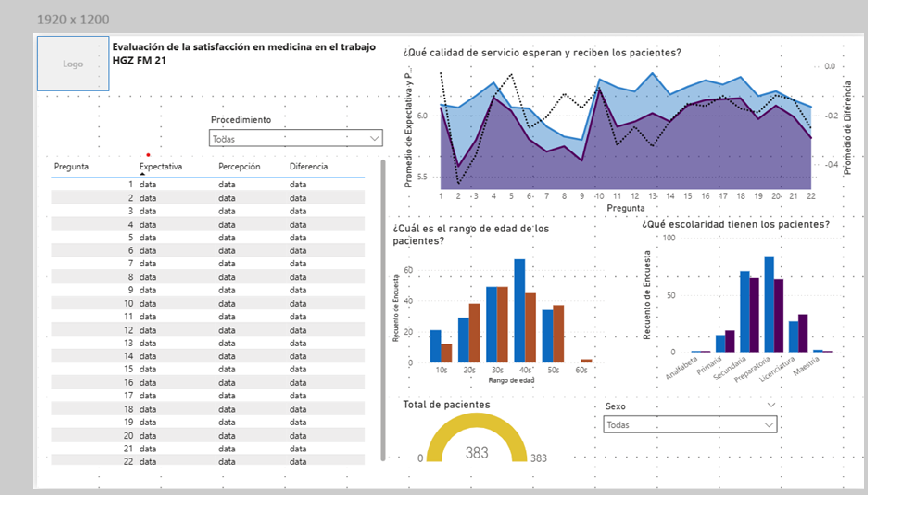

# Tabla de contenidos

-[Introducción](#Introducción)
-[Objetivo](#Objetivo)
-[Metodología](#Metodología)
    -[Recolección de datos](#Recolección-de-datos)
        -[Estructura de las encuestas](#Estructura-de-las-encuestas)
        -[Confidencialidad](#Confidencialidad)
    -[Etapas](#Etapas)
    -[Diseño](#Diseño)
        -[Componentes requeridos en el dashboard](#Componentes-requeridos-en-el-dashboard)
        -[Boceto de dashboard](#Boceto-de-dashboard)
        -[Herramientas](#Herramientas)
    -[Pseudocódigo](#Pseudocódigo)

# Introducción

El servicio de medicina del trabajo del Hospital General de Zona de Medicina Familiar 21, busca evaluar la calidad del servicio que sus pacientes reciben al realizar alguno de los siguientes procedimientos:

- Calificación accidente de trabajo  
- Dictamen Incapacidad Permanente Parcial
- Dictamen de Invalidez
- Calificación enfermedad de trabajo
- Dictamen beneficiario incapacitado
- Dictamen de invalidez
- Dictamen incapacidad Permanente Total

Se tiene interes en comparar las expectativas y percepciones de la atención médica.

# Objetivo

1. Diseñar y crear un dashboard interactivo que muestre:

    - Información general de los pacientes del servicio de medicina del trabajo utilizando slicers para visualizar las difrencias en la atención por procedimiento. 
    - Comparación entre las expectativas y percepciones del servicio médico recibido.

2. Crear una base de datos relacional que alimente al dashboard en el futuro.

# Metodología

## Recolección de datos

El personal médico aplicó encuestas a 383 pacientes que constaron de 22 preguntas. Cada paciente respondió dos encuestas una previa a la atención médica y la segunda después de haber recibido la atención médica. Todas las encuestas fueron llenadas en el lugar físico después de obtener el consentimiento informado de los pacientes participantes, a los cuales se les explico el alcance del estudio. Una vez recolectados los datos el área médica cargo dichos datos en un archivo tipo .csv.

### Estructura de las encuestas

Cada encuesta constaba de:

- Encabezado: Segmento dedicado a recabar información general del paciente tal como edad, nombre, sexo, escolaridad y procedimiento solicitado.

- Cuerpo: Segmento que contaba con 22 preguntas dedicadas a evaluar la satisfacción, tiempo dedicado y expectativas de los pacientes.

### Confidencialidad

Por razones de confidencialidad de los pacientes las preguntas no se muestran y los datos originales fueron modificados para no incluir información personal sensible que pueda ser ligado a los paciente en particular con fines de proteger sus datos personales.

## Etapas

- Diseño
- Desarrollo
- Prueba
- Análisis

## Diseño

### Componentes requeridos en el dashboard

¿Qué componentes debería de incluir el dashboard?

Para entender que debería de incluir se realizarón las preguntas siguientes:

1. ¿Qué edad tienen los pacientes?
2. ¿Qué escolaridad tienen los pacientes?
3. ¿Cuál es la proporción entre hombres y mujeres?
4. ¿Cuantos pacientes se reciben por procedimiento?
5. ¿Cuál es la expectativa de la atención médica?
6. ¿Cuál es la percepción de la atención médica recibida?
7. ¿Es mayor la expectatva o la percepción de la atención médica recibida?

### Boceto de dashboard

¿Cómo se vería el dashboard final?

Algunos elementos visuales para responder apropiadamente a las preguntas del personal médico incluirían:

1. Tabla de comparación de _expectativa_, _percepción_ y _diferencia_ por pregunta.
2. Gráfico de área que permita comparar rápidamente _expectativa_, _percepción_ y _diferencia_ por pregunta.
3. Gráfico de columnas agrupadas para conocer la distrbución del rango de edad de los pacientes.
4. Gráfico de columnas agrupadas para conocer la distribución de la escolaridad de los pacientes.
5. Un medidor para conocer la proporción de pacientes.
6. Un segmentador por procedimiento.
7. Un segmentador por sexo.

### Herramientas

| Herramienta | Rol | Responsabilidades |
|------------|-----|------------------|
| Excel | Fuente inicial de datos médicos | Almacenamiento del archivo original de encuestas.  Revisión preliminar. |
| Python (Notebooks) (_pandas, matplotlib, seaborn_) | Exploración y preprocesamiento de datos | Análisis exploratorio (EDA).  Limpieza y transformación de datos.  Ingeniería de características.  Visualizaciones exploratorias. |
| PostgreSQL DB | Capa analítica y de modelado de datos | Creación de tablas normalizadas.  Definición de _primary keys_ y _foreign keys_.  Creación de vistas analíticas.  Validación de calidad de datos. |
| Power BI | Visualización y comunicación de resultados | Consumo de tablas y vistas exportadas.  Creación de relaciones entre entidades.  Construcción de visuales y dashboard ejecutivo. |
| GitHub | Control de versiones y presentación del proyecto | Versionado de código y scripts SQL.  Organización del proyecto por capas (data/sql/scripts/notebooks).  Documentación del flujo de trabajo y reproducibilidad. |

## Pseudocódigo

- ¿Cuál es la estrategia general para crear la solución desde el inicio al final del proyecto?

1. Obtener datos.
2. Explorar los datos iniciales usando pandas, matplotlib y seaborn.
3. Realizar la limpieza de datos verificando que no haya datos nulos ni duplicados explícitos.
4. Enriquecer los datos de ser necesario creando columnas nuevas.
5. Cargar los datos en SQL Server.
6. Crear la base de datos y tablas necesrias para alimentar el dashboard.
7. Validar datos con SQL.
8. Cargar datos en Power BI.
9. Visualizar los datos en Power BI.
10. Concluir con los hallazgos encontrados.
